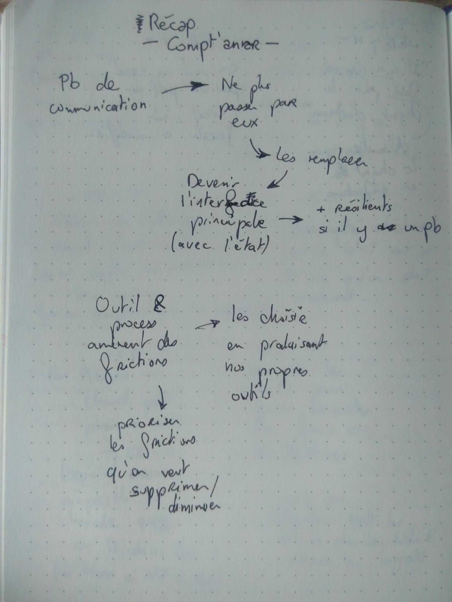
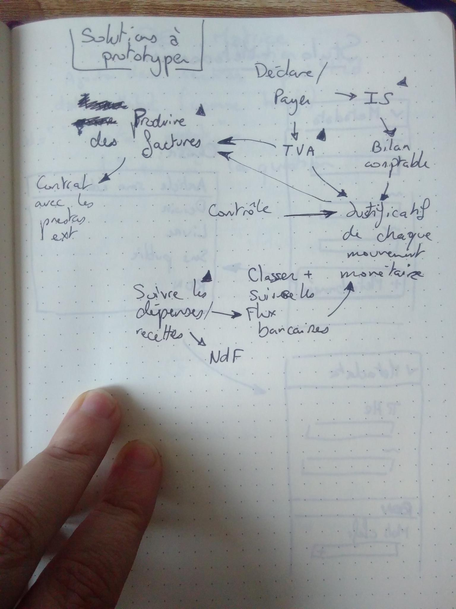

# Compta'bilisons les galères

On a décidé de faire une liste de toutes nos galères avec des cabinets comptables, celles qu'on a vécu depuis la création de l'Échappée Belle et celles des structures pré-Échappée Belle.

* Incompréhension Marketplace -> impute mal le positif et le négatif
* 1001 pharma : N'arrive pas à suivre la croissance de la start-up
* DTC : le comptable met 2-3 semaines de répondre
* Problème d'accompte basé sur l'année n-1 (accompte élevé) alors que année n en déficit
* DTC : Ghostés pour le bilan, Impot sur les Sociétés fait à la main pour ne pas être en retard
* EB : On nous dit que pour les frais de télé-travail tous les salariés doivent être au forfait, ou tous au réel 
* EB : On nous dit qu'on est obligés d'avoir un contrat de travail
* EB : Les 2 cabinets comptables nous assurent des choses différentes : l'un que la TVA est due à l'émission de la facture, l'autre à la réception du paiement
* EB : On nous dit que les modalités de modification des horaires en temps partiel sont une mention obligatoire sur le contrat de travail
* DTC : Écart de 2000€ entre bilan de clôture et le compte en banque
  * Comptables assure que c'est une remise de TVA et fait une demande aux impôts
* EB : On découvre qu'on a des pénalités avec l'URSSAF 
  * en se connectant au site
  * parce qu'on a pas payé quelque chose à temps
* EB : Taux d'AT ??
* Global : On peut pas partir quand on veut
* EB : "Pourquoi vous créez pas une autre boîte ?"
* EB : On peut pas se débrouiller seuls avec les impôts car les accès sont pris en totalité par le cabinet (+ on peut pas avoir de docs ??)
* EB : Dans les comptes mails ayant accès à notre compte URSSAF, il y a des mails que l'on ne connait pas
* EB : Calcul de l'aterrissage Excel / mal outillé, on capte les erreurs nous mêmes (et on comrpend pas les labels)
* EB : L'accompte déclaré pour le 4e trimestre est différent de ce qu'on doit vraiment 
* EB : Pas acccès au cloud pendant plusieurs mois
* EB : Le logiciel de saisie comptable ne marche que sur Windows 10 (ni Linux, ni MacOS, ni Windows 7)
* EB : La nécessité de détailler bcp de choses manuellement pour les notes de frais dans le logiciel
* EB : La nécessité de demander au cabinet explicitement les droits pour pouvoir créer des notes de frais
* EB : On nous dit que lorsque la structure change d'adresse, il n'y a rien à faire d'autre que la déclaration en préfecture
* EB : Demande d'avoir les relevés de compte en excel pas en pdf parce que l'excel serait plus facile à modifier

