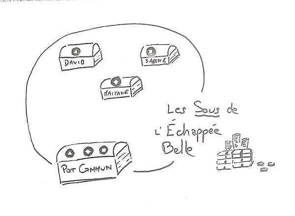

## 11 mars 2020

### Présent⋅e⋅s

David et Sabine

### Décisions

#### Déplacer l'attribution du Marché Public DINUM de dtc vers l'Échappée Belle

Non

On voit pas trop la valeur que ça nous apporte par rapport au travail que ça demande

#### Déplacer l'attribution du Marché Public de la Gironde de dtc vers l'Échappée Belle

Ok

David gère le sujet

#### Acceptation d'un morceau de boni de liquidation de dtc

Ok

David gère le sujet

#### Comptabilité analytique individuelle

David et Sabine ont envie d'en faire une
Mais ça ne sera pas une obligation pour les personnes suivantes

## 11 juin 2020

### Présent.e.s

Maïtané, David et Sabine

### Arrivée de Maïtané Lenoir

David Bruant et Sabine Safi proposent à Maïtané Lenoir de devenir membre de l'association l'Échappée Belle\
Et Maïtané Lenoir accepte

### Comment on rejoint l'Échappée Belle ?

A priori on ne rejoint pas l'Échappée Belle.
Ça peut arriver que les membres actuel.le.s de l'EB proposent à quelqu'un de rejoindre la structure.
C'est important pour nous de ne pas reproduire les structures de pouvoir et d'oppression de notre société, donc nous veillons à ce que les hommes blancs cishet ne soient pas majoritaires dans la structure.

### CAE, SCOP ou asso ?

(Décidé quelques mois avant par David et Sabine mais pas documenté sur le moment)
CAE ça a l'air plus relou que SCOP alors qu'en SCOP à priori on peut avoir ce qu'on veut en ayant tou.te.es le statut de gérant non salarié mais rémunéré.
Mais on est *théoriquement* en attente d'une ultime réponse de l'avocat sur la SCOP.
Du coup, on (David et Sabine) n'a pas envie d'attendre cette réponse pour passer sous un statut salarié ou assimilé, donc on choisit de créer une association au moins pour commencer, parce que c'est *théoriquement* facile, rapide et non coûteux à créer.
On verra si on la transforme plus tard en SCOP ou si on reste sous le statut d'association.

## 1 septembre 2020

### Présent.e.s

Maïtané, David, Sabine et Stéphane

### Arrivée de Stéphane Langlois

David Bruant et Sabine Safi et Maïtané Lenoir proposent à Stéphane Langlois de devenir membre de l'association l'Échappée Belle\
Et Stéphane Langlois accepte

### Membres et salariat

La règle générale est que les membres de l'association sont ses salarié.e.s. Il peut arriver que des personnes qui ont seulement l'intention de devenir salarié.e.s sans l'être encore deviennent membres

## 29 septembre 2020

### Présent.e.s
Maïtané, David, Sabine

On a envie de laisser de la place aux personnes qui subissent des oppressions systémiques.
Le 1er septembre, on a écrit : "C'est important pour nous de ne pas reproduire les structures de pouvoir et d'oppression de notre société, donc nous veillons à ce que les hommes blancs cishet ne soient pas majoritaires dans la structure." Cette phrase ne nous satisfait pas car on ne veut pas aborder les personnes par le prisme de l'oppression systémique. Mais en attendant de trouver mieux, on la garde.

## 1er février 2021

Julia rejoint l'Échappée Belle, via un contrat CAPE qu'on est en train de mettre en place.

## 6 avril 2021

Julia décide de quitter l'association et son contrat CAPE parce que c'était relou administrativement.

## 14 juillet 2021

### Présent⋅e⋅s

David, Sabine et Maïtané

### Décisions

#### Les nouvelleaux entrant·es

On se dit que pour faire rentrer une nouvelle personne : 
- Déjà on voit si ça colle entre nous et elle,
- On peut parler du modèle de menaces,
- On voit comment ça se passe coté sous, entre :
  - Combien la personne a besoin en revenus
  - Comment ces revenus vont être générés. 

Par ex, ça peut être, tout ou partie :
- via de la facturation,
- via du chômage ou autres trucs de l'état,
- via le pot commun de l'Échappée Belle…et dans ce cas on en discute ensemble car il faut qu'il y ai assez d'argent dans le pot commun

#### Comment on fait si quelqu'un ne répond pas ?

Pour l'instant, on contacte les membres de l'Échappée Belle par slack et mail.

Chacun·e peut préciser un moyen de communication de "dernier recours", que chacun·e s'engage à consulter a minima. Ce moyen de communication pourra être utilisé par les autres membres de l'Échappée Belle afin d'informer la personne de prise de décisions importantes à venir, pour qu'iel puisse y participer si iel le souhaite :
- Pour Sabine, par SMS sur son téléphone
- Pour Maïtané, par SMS sur son téléphone
- Pour David, sur davidbruant@protonmail.com

Si durant une absence prolongée et malgré les relances, dont au moins une sur le moyen de "dernier recours", un membre et/ou salarié·e ne répond pas, les autres membres de l'Échappée Belle se prévoient la possibilité de :
- lui oter son statut de membre, elle n'aura alors plus accès à la gouvernance de l'association ;
- licencier la personne, pour abandon de poste.

La décision reste réversible, et sera discutable lorsque la communication sera rétablie.

#### Le pot commun

L'ensemble des membres de l'Échappée Belle portent une attention à alimenter le pot commun afin qu'il ne soit jamais en négatif.
Les dépenses du pot commun doivent être décidées collectivement, comme un coffre qui ne s'ouvrirait que lorsque chaque membre y mettrait sa clef.

Actuellement, dans le pot commun est prélevé :
- L'assurance(~150 €/an)
- La banque (~200 €/an)
- L'expert comptable (~4000 €/an)
- L'impôt sur les sociétés (parce qu'on n'a pas trouvé de manière juste de l'imputer individuellement) ( https://www.service-public.fr/professionnels-entreprises/vosdroits/F23575 )

## 30 novembre 2021

### Présent⋅e⋅s

Sabine, Maïtané, David et Érick

Érick Gardin rejoint l'Échappée Belle.\
**Edite (14/10/22) :** son moyen de communication de "dernier recours" est par SMS sur son téléphone

## 6 janvier 2022

### Présent⋅e⋅s

Sabine, Maïtané, David et Érick

### Sortie de Stéphane
Stéphane Langlois n'est plus membre de l'Échappée Belle par inactivité. La porte reste ouverte pour revenir à tout moment.

### Prêt d'argent à David
L'Échappée Belle est d'accord pour prêter 2000€ du pot commun à David pour son projet immobilier. 

**Edite (14/10/22) :** après vérification, ce n'est surement pas légal et donc on va pas le faire.

## 6 juillet 2022

### Présent⋅e⋅s

Sabine, Maïtané, David et Érick

### Droit au chômage

Afin de savoir si un membre salarié a droit aux allocations chômages nous avons constitué un dossier de plusieurs dizaines de pages que nous avons soumis à Pôle Emploi dans le cadre d'une [procédure de rescrit](https://www.pole-emploi.fr/employeur/vos-declarations-et-cotisations/dirigeants-mandataires-associes/entreprises-verifiez-les-droits.html).

**Édite (12/08/22) :** 🎉 [réponse positive de Pôle Emploi](documents/2022 08 réponse rescrit pôle emploi.pdf)

## 14 octobre 2022

### Présent⋅e⋅s

Sabine, Maïtané, David et Érick

### Gestion de l'argent en cas de départ

Tiens, au fait, on a jamais expliqué notre fonctionnement lié aux sous :\
Dans l'idée, les prestations facturées par un membre de l'Échappée Belle constituent sa trésorerie un peu comme dans une Coopératif d'Activité et d'Emploi (CAE).\
Cette trésorerie permet au membre de se verser un salaire.\
Nous avons un petit fichier permettant de faire ce suivi des trésoreries individuelles régulièrement.

Si cette personne ne veut plus être salariée et qu'il lui reste de la trésorerie alors elle propose un destin concernant ce reste aux autres membres.\
Iels décident à l'unanimité de ce qu'il en sera.\
Notamment en faisant attention à la sécurité financière de l'association (TVA, IS sur l'exercice en cours, …)

## 22 février 2023

### Présent⋅e⋅s

Fanny, Maiana, Sabine, Maïtané, David et Érick

Fanny Cheung et Maiana Lenoir rejoignent l'Échappée Belle.\
Le moyen de communication de "dernier recours" de Fanny est par SMS sur son téléphone.\  
Le moyen de communication de "dernier recours" de Maiana est par SMS sur son téléphone.\

## 22-23 février 2023

### Présent⋅e⋅s

Sabine, Maïtané, David, Erick et Maïana

### Les aventures de l'Échappée Belle

Le pot commun (voir journal de décision, 14 juillet 2021) remplit actuellement plusieurs usages : 
- payer les frais communs nécessaires à la structure (assurance, banque, comptable, impôts sur le société, CFE, etc.)
- payer certaines aventures (Scribouilli, faiseuses du web, stagiaires, etc.)

Et ptèt que c'est pas très judicieux de fonctionner comme ça, parce que quand une personne met de l'argent dans le pot commun depuis son coffre individuel, elle n'a pas forcément envie de financer certaines aventures parce que ça risquerait de ne pas pouvoir payer les frais nécessaires à la structure

Alors, nous avons décidé de créer un pot "aventures" dédié qui permet de financer les aventures. Les individus peuvent y verser de l'argent. Et aussi, on peut y verser collectivement de l'argent depuis le pot commun

Le prévisionnel du pot aventures peut être en négatif si nous avons suffisamment confiance dans les rentrées d'argent prochaines pour combler ce prévisionnel

### Minimum dans le pot commun

Nous avons décidé que le pot commun devrait toujours contenir environ 6 mois d'avance de frais fixes

Après divers calculs, en 2023, chaque mois, nous avons/allons avoir ~350€ de frais fixes, donc ça fait 2100€ d'avance dans le pot commun

